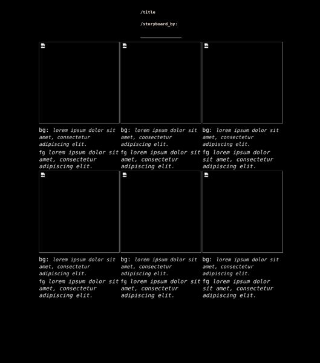

# /storyboard_html 
  
* it's html only doc, but needs to branch out to CSS features soon
* this is just another way to present your boards. 
* can be modified to various things such as; your default homepage, nft-wallet showcase, a website, etc.
 # #
